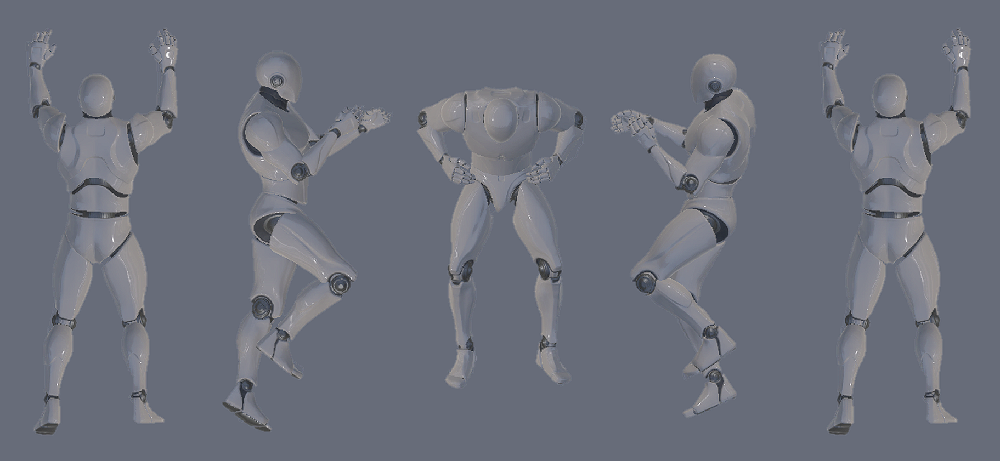
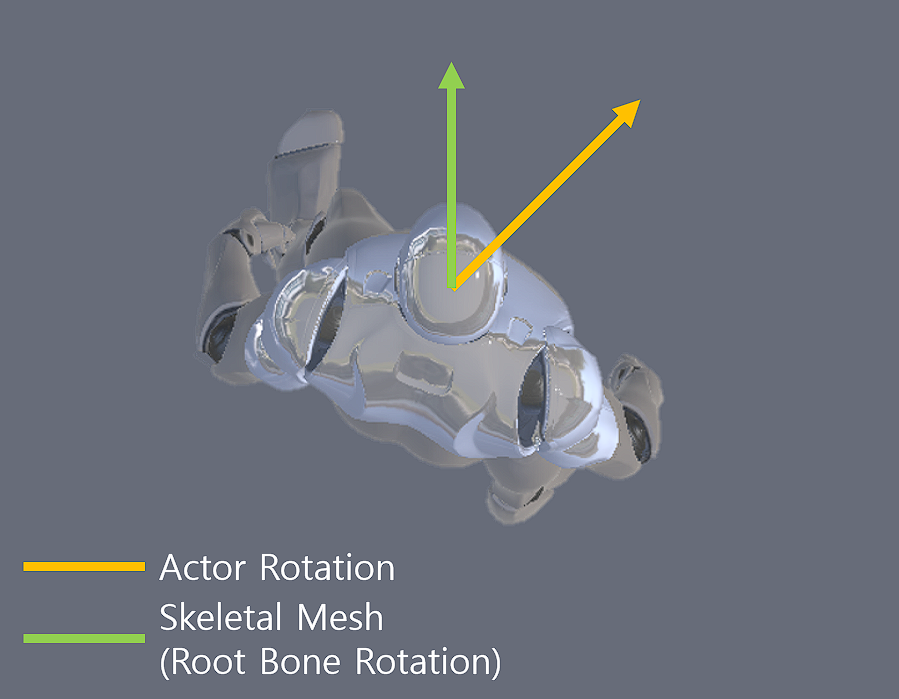
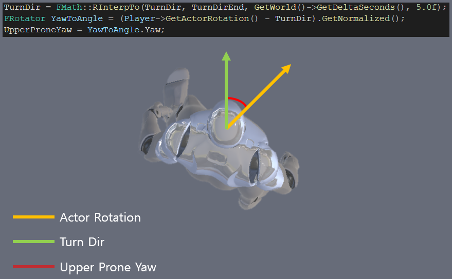

# ProneSystem

Developed with Unreal Engine 4

## 목적

 좀 더 현실적인 엎드리기 시스템 구현을 목적으로 만든 저장소 입니다.
목표는 맥스페인과 메탈기어 솔리드와 같이 엎드린 상태에서 360도 회전을 할 때 자연스러운 모습을 보이게 만드는 것입니다.

## 구현방법(기본 이론)

 기본 이론은 Actor Rotation을 돌린 만큼(Controller Rotation) Skeletal Mesh의 Root Rotation을 반대로 돌리면 
Actor Rotation은 돌지만 외형은 가만히 있는 것 처럼 보이게 됩니다.

 엎드리기 상태에 들어가기 시작할때 Actor Rotation을 구해서 TurnDir에 넣고 (TurnDir이 중심점이 됩니다.) 
플레이어의 Controller Rotation에 따라 Actor Rotation이 움직이면
TurnDir과 Actor Rotation의 각도(Yaw)의 차이만큼 Skeletal Mesh의 Root Rotation을 반대로 돌리면 됩니다.

  Skeletal Mesh의 Root Rotation를 돌릴려면 AnimBP에서 Rotate Root Bone을 이용해서 돌리거나 블랜드에서 직접 Root Rotation을 돌려서 만들면 됩니다.

## 영상

 

 

## 진행상황
360도 회전 구현 완료, 이동시 중심축 이동, 뒤집혀진 상태(등이 바닥을 향하는)에서 일어서기 구현, 엎드리기 상태시 시점(위, 아래)에 따른 상체 이동
